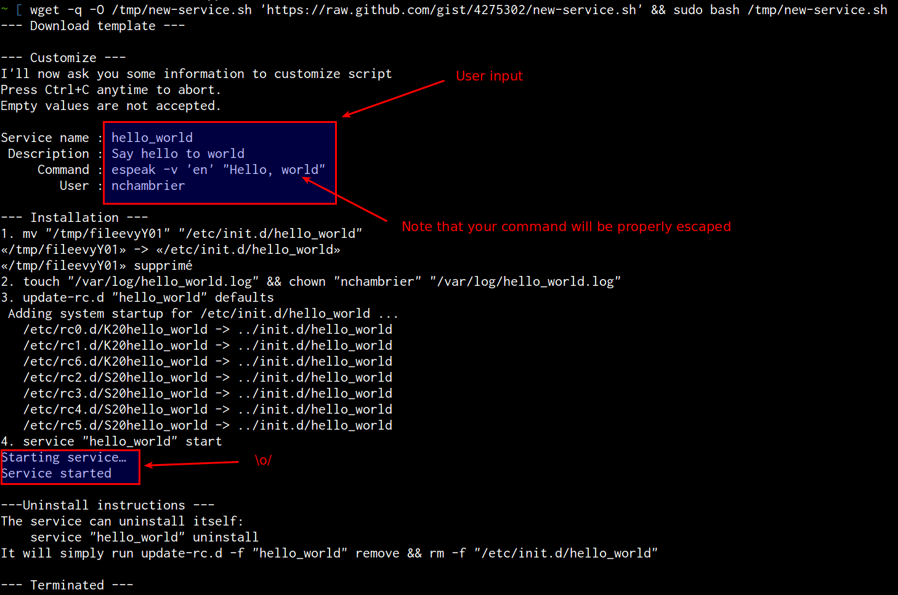

Note: You can acheive the same thing that this project tries to acheive by using the MetaInit package in debian:
(https://wiki.debian.org/MetaInit)

# Sample service script for debianoids

Look at [LSB init scripts](http://wiki.debian.org/LSBInitScripts) for more information.

Original script taken from from [naholyr's](https://github.com/naholyr) [gist](https://gist.github.com/naholyr/4275302)

## Usage

Copy to `/etc/init.d`:

```sh
# replace "$YOUR_SERVICE_NAME" with your service's name (whenever it's not enough obvious)
cp "service.sh" "/etc/init.d/$YOUR_SERVICE_NAME"
chmod +x /etc/init.d/$YOUR_SERVICE_NAME
```

Edit the script and replace following tokens:

* `<NAME>` = `$YOUR_SERVICE_NAME`
* `<DESCRIPTION>` = Describe your service here (be concise)
* Feel free to modify the LSB header, I've made default choices you may not agree with
* `<COMMAND>` = Command to start your server (for example `/home/myuser/.dropbox-dist/dropboxd`)
* `<USER>` = Login of the system user the script should be run as (for example `myuser`)

Start and test your service:

```sh
service $YOUR_SERVICE_NAME start
service $YOUR_SERVICE_NAME stop
```

Install service to be run at boot-time:

```sh
update-rc.d $YOUR_SERVICE_NAME defaults
```
For rpm based distributions such as CentOS or Red Hat, you can use

```sh
chkconfig $YOUR_SERVICE_NAME --add
```
If you want to see which runlevel your script will run in

```sh
chkconfig $YOUR_SERVICE_NAME --list
```

Enjoy

## Uninstall

The service can uninstall itself with `service $NAME uninstall`. Yes, that's very easy, therefore a bit dangerous. But as it's an auto-generated script, you can bring it back very easily. I use it for tests and often install/uninstall, that's why I've put that here.

Don't want it? Remove lines 56-58 of the service's script.

## Logs?

Your service will log its output to `/var/log/$NAME.log`. Don't forget to setup a logrotate :)

## I'm noob and/or lazy

Yep, I'm lazy too. But still, I've written a script to automate this :)

```sh
wget 'https://raw.githubusercontent.com/dc55028/sample-service-script/master/new-service.sh' && bash new-service.sh
```

In this script I will download `service.sh` into a `tempfile`, replace some tokens, and then show you commands you should run as superuser.

If you feel confident enough with my script, you can `sudo` the script directly:

```sh
wget 'https://raw.githubusercontent.com/dc55028/sample-service-script/master/new-service.sh' && sudo bash new-service.sh
```

Note: the cool hipsterish `curl $URL | bash` won't work here, I don't really want to check why.

The script works offline so you can clone this repository then you can upload this script on your server and run it 
directly:

```sh
sudo bash new-service.sh
```

The script also handle parameters as showed below:

```sh
sudo bash new-service.sh "service_name" "description" "command to execute" "user which should run command"
```

### Demo

Creating the service:



Looking at service files (logs, pid):


Uninstalling service:


